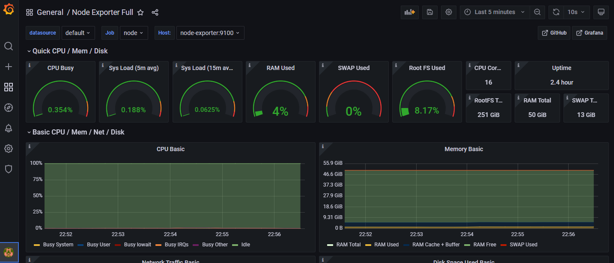

# node-exporter-grafana-prometheus

Docker compose wrapper for node-exporter + Grafana + Prometheus.

## Run

1. Run
```shell
docker-compose up -d
```

2. Create prometheus datasource for `host.docker.internal:9090`

3. Create or Import dashboard ([example](https://grafana.com/grafana/dashboards/1860))

